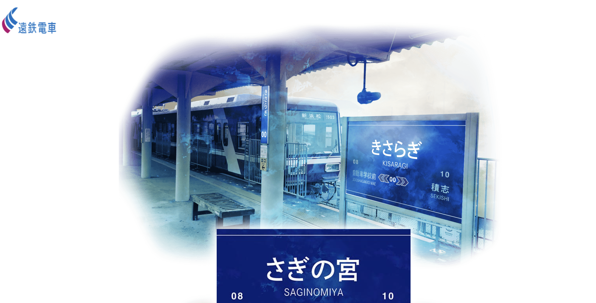
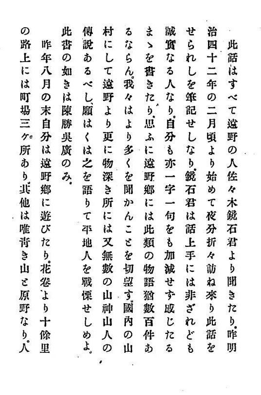

<!-- _class: title -->

# Kisaragi-eki

きさらぎ駅

## Japanische Internet-Horror-Folklore

04/01/09 &nbsp;·&nbsp; 2ch.net &nbsp;·&nbsp; Jetzt auf Deutsch

---

# Inhaltsübersicht

1. Was ist "Kisaragi-eki" - Überblick
1. Kontext 1 - Japanische Kaidan-Kultur
1. Kontext 2 - Netto Kaidan und 2channel
1. Fazit

---

<!-- _class: divider -->

# Es begann nachts des 8. Januar 2004

I

Thread: 「身の回りで変なことが起こったら実況するスレ 26」([simuliertes Thread](https://nbtkmy.github.io/kisaragieki/))
*„Live-Bericht-Thread, wenn seltsame Dinge passieren, Teil 26"*

---

<!-- _class: post -->

### 23:14 Uhr — Die Nachricht beginnt

  
No.98 &nbsp;/&nbsp; はすみ &nbsp;/&nbsp; 04/01/08 23:14

  
„Es mag Einbildung sein, aber darf ich etwas fragen?"

  
気のせいかも知れませんがよろしいですか？

  
No.99 &nbsp;/&nbsp; 04/01/08 23:16

  
„Nur zu."

  
No.101 &nbsp;/&nbsp; はすみ &nbsp;/&nbsp; 04/01/08 23:18

  
„Ich bin in einer Privatbahn, aber es ist seltsam."

  
先程から某私鉄に乗車しているのですが、様子がおかしいのです。

  
No.107 &nbsp;/&nbsp; はすみ &nbsp;/&nbsp; 04/01/08 23:23

  
„Der Zug hält seit 20 Minuten nicht. Normalerweise alle 5–8 Minuten. Fünf andere Fahrgäste schlafen."

---

<!-- _class: divider -->

# »Kisaragi«

*Ein Bahnhof, den es nicht geben sollte.*

---

<!-- _class: post -->

### 00:29 Uhr — Der Bahnhof I

  
No.167 &nbsp;/&nbsp; はすみ &nbsp;/&nbsp; 04/01/09 00:29

  
„Ich bin ausgestiegen. Es ist ein unbemannter Bahnhof. Ich glaube, ich bin um 11:40 Uhr eingestiegen."

  
降りてしまいました。無人駅です。乗った電車は１１時40分だったと思います。

  
No.170 &nbsp;/&nbsp; 04/01/09 00:32

  
„'Kisaragi Station' taucht nicht in den Suchergebnissen auf..."

  
No.176 &nbsp;/&nbsp; はすみ &nbsp;/&nbsp; 04/01/09 00:34

  
„Ich versuche zurückzukommen, aber ich finde keinen Fahrplan. Der Zug steht noch, also wäre es vielleicht sicherer, wieder einzusteigen. Oh, da fährt er schon los."

  
戻ろうと思い時刻表を探しているのですが見当たりません。電車はまだ停車していますのでもう一度乗ったほうが無難でしょうか。と書いてるうちにいってしまいました。

---

<!-- _class: post -->

### 00:29 Uhr — Der Bahnhof II

  
No.200 &nbsp;/&nbsp; 04/01/09 00:43

  
„>>Hasumi-san
Ähm... Es gibt keinen Bahnhof namens Kisaragi, könntest du das bitte noch einmal überprüfen? Der Name des Bahnhofs."

  
No.221 &nbsp;/&nbsp; 04/01/09 00:57

  
„Ich habe gerade nachgeschlagen, und wenn man '鬼' schreibt, kann man es als 'Kisaragi' lesen…?"

  
No.225 &nbsp;/&nbsp; 04/01/09 01:00

  
„>>221
Oni‑Station? … oh."

  
No.229 &nbsp;/&nbsp; はすみ &nbsp;/&nbsp; 04/01/09 01:01

  
„[...] Es gibt keine Anzeige für die nächste oder die vorherige Station."

  
[...] 次の駅も前の駅も表示がないです。

---

<!-- _class: post -->

### 00:29 Uhr — Der Bahnhof III

  
No.386 &nbsp;/&nbsp; はすみ &nbsp;/&nbsp; 04/01/09 01:57

  
„Ich höre von weitem ein Trommel‑ähnliches Geräusch und ein klingelndes Summen, aber ehrlich gesagt weiß ich nicht mehr, was ich tun soll."

  
No.395 &nbsp;/&nbsp; 04/01/09 02:00

  
„Es fängt jetzt an…"

  
No.401 &nbsp;/&nbsp; はすみ &nbsp;/&nbsp; 04/01/09 02:01

  
„Vielleicht wird das als Lüge angesehen, aber ich habe Angst und kann nicht zurückschauen. Ich möchte zum Bahnhof zurück, aber ich kann mich nicht umdrehen."

  
No.406 &nbsp;/&nbsp; 04/01/09 02:03

  
„>>401
Renne. Drehe dich niemals um."

---

<!-- _class: divider -->

# Japanische Kaidan-Kultur

II

---

### Setsuwa (説話)

- Lange Tradition der "seltsamen Geschichten", z.B. 日本国現報善悪霊異記 (Nihonkoku genpō zen'aku ryōiki, etwa 822)
- Solche „Horror"-Geschichten dienten der Religion

---

### Entwicklung in der Edo-Zeit

- Kaidan/Horror-Geschichten als reine Unterhaltung
- Mimibukuro (耳嚢) — verfasst von Negishi Shizumori (根岸鎮衛) zwischen 1784? und 1814

---

### Entwicklung seit Meiji-Zeit
- Tōno monogatari (遠野物語) / hrsg. von Yanagita Kunio (柳田国男). 1910
- Geistergeschichten zugleich als Gegenstand der Ethnologie

---

<!-- _class: divider -->

# Netto Kaidan und 2channel

III

---

## Was ist *Netto Kaidan*?

**Netto Kaidan** (ネット怪談) — Internet-Horrorgeschichten, die auf japanischen Textboards entstanden sind.

| Merkmal | Beschreibung |
|---|---|
| Medium | Anonyme Foren (2ch, etc.) |
| Format | Livebericht, Screenshot-Threads |
| Besonderheit | Mehrstimmig — Poster reagieren in Echtzeit |
| Wirkung | Grenze zwischen Fiktion und Realität verschwimmt |

> Bekannte Beispiele: *Kunekune(くねくね)*, *Kotoribako(コトリバコ)*, **Kisaragi-eki**

---

## 2channel (2ちゃんねる)

- **1999** gegründet von Nishimura Hiroyuki (西村博之) — größtes japanisches Internetforum seiner Zeit
- **Anonymität als Prinzip**: kein Nutzername, kein Profil — jeder postet als „名無しさん" (*Mr. Niemand*)
- Bestimmte Threads nutzen das **実況-Format** (*jikkyō*, Live-Bericht): Nutzer berichten in Echtzeit über laufende Ereignisse — z.B. *„身のまわりで変なことが起こったら実況するスレ"* — genau der Thread, in dem Kisaragi-eki entstand

---

## Horrorgeschichten auf 2channel

- Bekannter Thread: *「死ぬ程洒落にならない怖い話を集めてみない？」*
  „Lasst uns Geschichten sammeln, die so gruselig sind, dass es kein Spaß mehr ist"
- Viele Geschichten waren bereits anderswo im Internet veröffentlicht — **Copy-Paste-Kultur**: Inhalte wandern ohne feste Quelle
- Entscheidend: Die Poster wollen **keine Autoren sein** — keine Urheberschaft, keine Signatur, nur die Geschichte zählt *(Ausnahmen existieren)*

---

<!-- _class: divider -->

# Fazit

IV

---

## Das Erzählmotiv bleibt — alles andere verändert sich

- **Das Was** ist uralt: der Schrecken vor einer Welt jenseits der unseren — das zieht sich von Setsuwa bis Kisaragi-eki durch.
- **Das Wie** hat sich transformiert: nicht mehr nachträglich gesammelt und vom Gelehrten geformt, sondern miterlebt, in Echtzeit, ohne Abstand.
- **Das Wer** hat sich demokratisiert: kein Negishi, kein Yanagita — eine anonyme Frau in einem Zug, und Dutzende Unbekannte, die ihr sagen: *Lauf. Schau dich nicht um.*

---

<!-- _class: divider -->

# Literatur

---

- Donath, Judith S. „Identity and Deception in the Virtual Community“. In Communities in Cyberspace, herausgegeben von P. Kollock und M. Smith. Routledge, 1998.
- Taylor, Tosha R. „Horror Memes and Digital Culture“. In The Palgrave Handbook of Contemporary Gothic, herausgegeben von Clive Bloom. Springer International Publishing, 2020. https://doi.org/10.1007/978-3-030-33136-8_58.
- Hirota, Ryūhei. Netto kaidan no minzokugaku (ネット怪談の民俗学). Hayakawa Shobō, 2024.
- Tsutsumi, Kunihiko. Ōedo kaidan jijō : „Mimibukuro“ no kaii o himotoku (大江戸怪談事情: 『耳嚢』の怪異をひもとく). Yoshikawa Kōbunkan, 2025.

